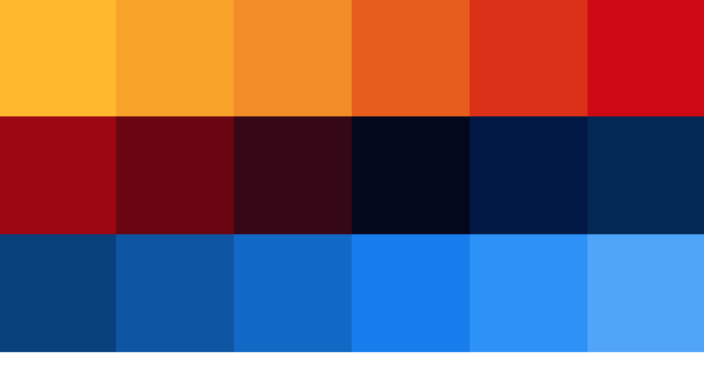

# Color Boxes

### Description

This project aims to continue working with props, defaultProps, state, and simple click events in React and to show the limits of the tools we have for now.

Initially, each box should have a background color chosen from a random list of colors. When you click any box: it should change its color to a different random color.

It displays an interface showing a series of 16 boxes that looks like this:

### Technologies

*Languages:* Javascript, HTML, CSS

*Library:* React

### Key features

* Display a series of 16 boxes with a nice gradient

* Clicking any box should change its color to a different random color

### Poject status

The project is done.

### Credits & Sources

* Color palette created with [Coolors](https://coolors.co/)
  
* Another small project from [The Modern React Bootcamp](https://www.udemy.com/course/modern-react-bootcamp)
